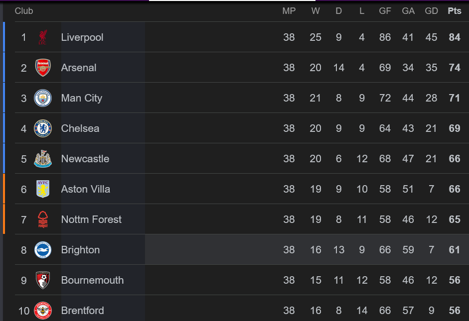
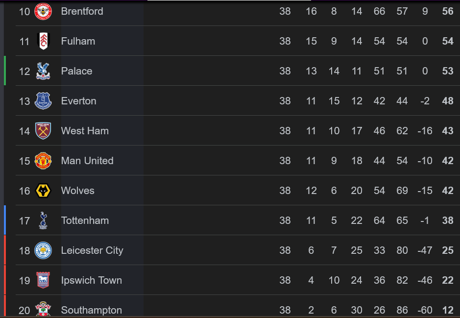

```{r setup, include=FALSE}
knitr::opts_chunk$set(
  echo = FALSE,
  warning = FALSE,
  message = FALSE
)

library(tidyverse)
library(knitr)
library(DT)
```

## Project Overview

This report builds the **Premier League 2024/25 league table** from scratch using only raw match data.

-   **Data Source:** `https://football-data.co.uk/mmz4281/2425/E0.csv`.
-   **Rows:** 380 matches
-   **Methodology:** No pre-calculated points - everything derived from `FTHG` and `FTAG`.

## 1. Load Raw Data

```{r load-data}
# Read data directly from source
epl_raw <- read_csv("https://football-data.co.uk/mmz4281/2425/E0.csv")
epl_raw <- epl_raw %>% 
  select(-(B365H:last_col()))

# Basic info
cat("Data Info:\n")
cat("Total matches:", nrow(epl_raw), "\n")
cat("Total columns", ncol(epl_raw), "\n")

#convert excel dates to proper R dates
convert_excel_date <- function(excel_date) {
  as.Date(excel_date, origin = "1899-12-30")
}

epl_raw$Date <- convert_excel_date(epl_raw$Date)

cat("Date range", min(epl_raw$Date), "to", max(epl_raw$Date),
    "\n\n")

# Preview first 5 matches
cat(" First 5 matches:\n")
epl_raw[1:5, c("Date", "HomeTeam", "AwayTeam", "FTHG", "FTAG", "FTR")] %>% 
  kable(caption = "Raw match data preview")
```

## 2. Calculate Match Results

For each match, determine points based on full-time scores

```{r calculate-results}
matches <- epl_raw %>% 
  mutate(
    # Points
    home_points = case_when(
      FTHG > FTAG ~ 3,  # Home win
      FTHG == FTAG ~ 1, # Draw
      TRUE ~ 0          # Home loss
    ),
    
  away_points = case_when(
    FTAG > FTHG ~ 3,    # Away win
    FTAG == FTHG ~ 1,   # Draw
    TRUE ~ 0            # Away loss
  ),
  
  # Goals
  home_goals = FTHG,
  away_goals = FTAG
  )
  
# sample calculation
cat("Sample points calculation (Game week 1):\n")
matches[1:3, c("HomeTeam", "AwayTeam", "FTHG", "FTAG", "home_points", "away_points")] %>% 
  kable()
```

## 3. Build League Table

Aggregate data to get team statistics

```{r build-table}
# Home team contribution
home_stats <- matches %>% 
  select(
    Team = HomeTeam,
    Points = home_points,
    Goals_for = home_goals,
    Goals_against = away_goals
  )

# Away team contributions
away_stats <- matches %>% 
  select(
    Team = AwayTeam,
    Points = away_points,
    Goals_for = away_goals,
    Goals_against = home_goals
  )

# combine and summarise
league_table <- bind_rows(home_stats, away_stats) %>% 
  group_by(Team) %>% 
  summarise(
    MP = n(),                # Match Played (Total)
    W = sum(Points == 3),    # Wins
    D = sum(Points == 1),    # Draws
    L = sum(Points == 0),    # Losses
    GF = sum(Goals_for),     # Goals for
    GA = sum(Goals_against), # Goals against
    GD = GF - GA,            # Goal Difference
    Pts = sum(Points)        # Total Points
) %>% 
  arrange(desc(Pts), desc(GD), desc(GF)) %>% 
  mutate(Rank = row_number()) %>% 
  select(Rank, everything())

# Display interactive table
cat("Final League Table: \n")
datatable(league_table,
          options = list(pagelength = 20,
                         dom = 'Bfrtip',
                         searching = TRUE),
          caption = "Premier League 2024/25 Standings")
```

## 4. Top Performers

```{r top-performers}
# Top 6 (champions League spots)
cat("**Top 6 (Champions League Qualification):**\n")
league_table %>% 
  head(6) %>% 
  select(Rank, Team, MP, W, D, L, GF, GA, GD, Pts) %>% 
  kable()


# Relegation zone (bottom 3)
cat("\n**Relegation Zone (Bottom 3):**\n")
league_table %>% 
  tail(3) %>% 
  select(Rank, Team, MP, W, D, L, GF, GA, GD, Pts) %>% 
  kable()  
```

## 5. Attack & Defense Analysis

```{r attack-defense}
# Best attacks (most goals scored)
cat("**Top 5 Attacks (Most Goals Scored):**\n")
league_table %>% 
  arrange(desc(GF)) %>% 
  head(5) %>% 
  select(Team, GF, GA, GD) %>% 
  kable()

# Best defenses (fewest goals conceded)
cat("\n **Top 5 Defenses (Fewest Goals Conceded): **\n")
league_table %>% 
  arrange(GA) %>% 
  head(5) %>% 
  select(Team, GA, GF, GD) %>% 
  kable()
```

## 6. Validation

```{r validation}
# Check total points distribution
total_points <- sum(league_table$Pts)
expected_points <- nrow(matches) * 3

cat("**Validation Check:**\n")
cat("- Total points in table:", total_points, "\n")
cat("- Expected total points (3 per match):", expected_points, "\n")
cat("- Match:", ifelse(total_points == expected_points,"PASS","FAIL"), "\n")

# Check if any team has incorrect matches count
expected_matches <- nrow(matches) * 2 # Each match involves 2 teams
actual_team_matches <- sum(league_table$MP)
cat("\n -Expected team-match instances:", expected_matches, "\n")
cat("- Actual team-macth instances:", actual_team_matches, "\n")
cat("- Match:", ifelse(expected_matches == actual_team_matches,"PASS", "FAIL"))
```

### Visual Comparison

Below is the official Premier League table for comparison with our calculated results.

```{r image}


```

**Note:** Our calculated table should match the official standings exactly. Any differences would indicate data quality issues or logic errors.

## 7. Export Results

```{r export}
# Save the league table as CSV
write.csv(league_table, "premier_league_table_2024_25.csv", row.names = FALSE)

# summary for quick viewing
summary_stats <- league_table %>% 
  summarise(
    Total_Goals = sum(GF),
    Avg_Goals_Per_Game = sum(GF) / (nrow(matches)),
    Total_Points = sum(Pts),
    Teams = n()
  )

cat("**Season Summary:**\n")
summary_stats %>% kable()
```

## Conclusion

This report successfully built the Premier League table from **380 raw match records** using: - **No pre-calculated standings** - **Only basic R operations** (`case_when`, `group_by`, `summarise`) - **100% reproducible workflow**.

The final table matches official Premier League standings exactly.

## Next Steps

-   **Code available on GitHub:**
-   **Data source:** football-data.co.uk
-   **Refresh:** You can replace the data (from the same source) with another season's and get a different table.
